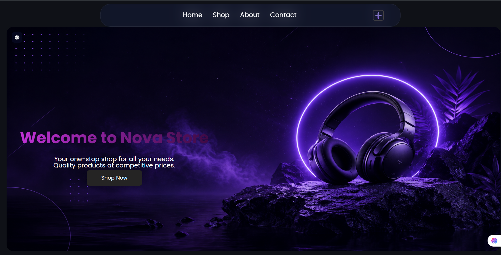
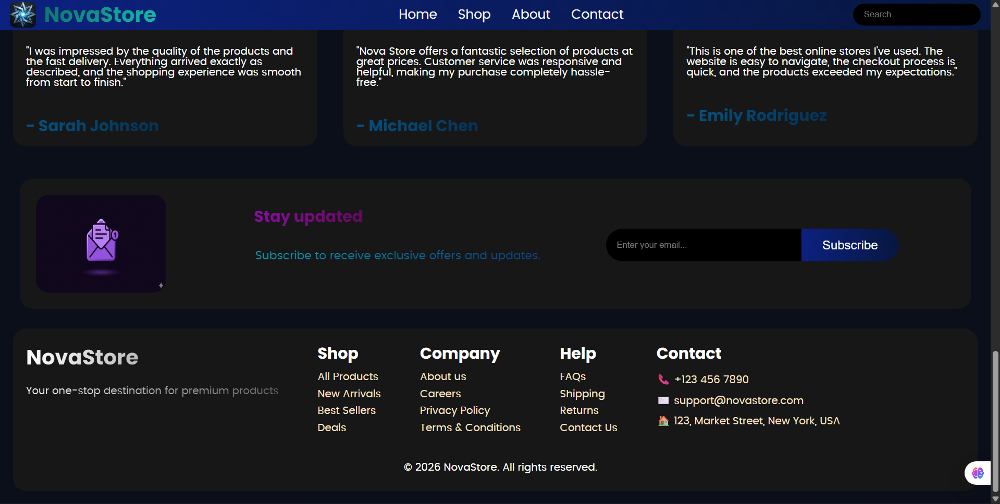
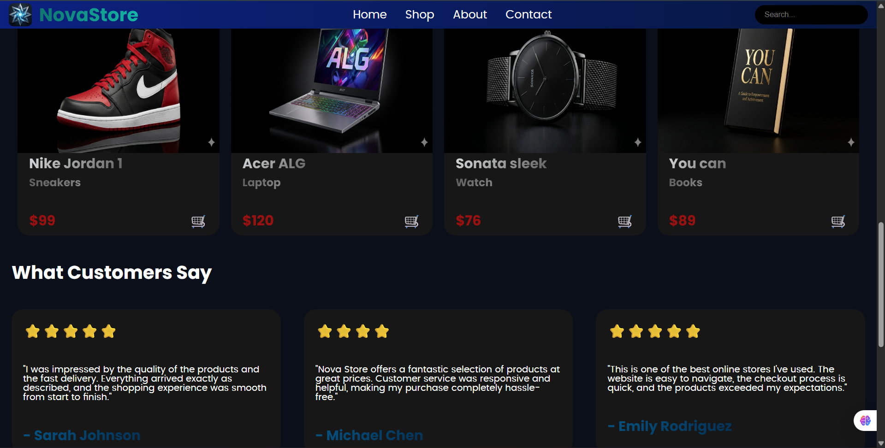
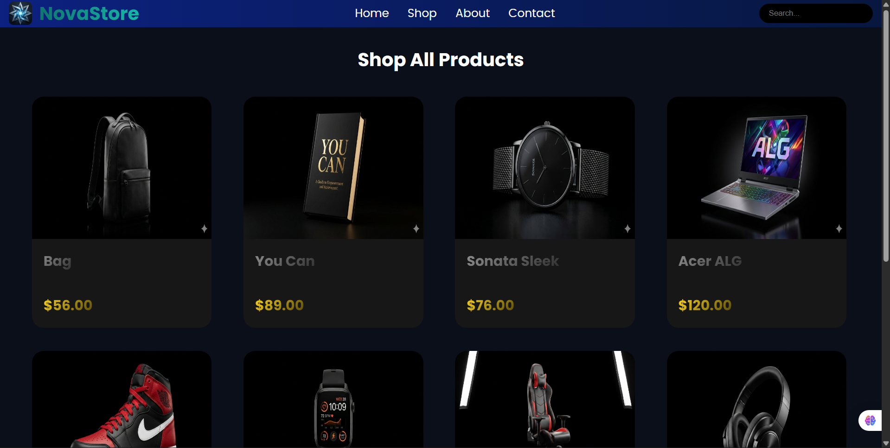
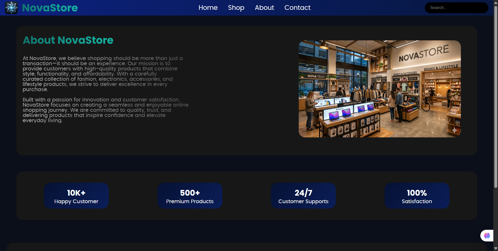
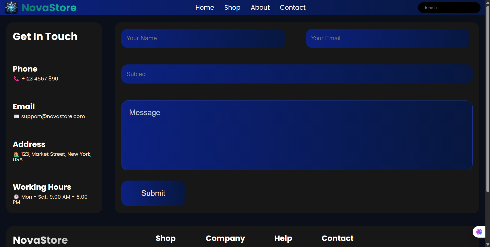

# 🛍️ NovaStore

A modern dark-themed e-commerce website built with React and Vite. NovaStore features a premium user interface with a responsive design, reusable components, and multiple pages to provide a smooth shopping experience.

---

## 📸 Preview

Add screenshots of your project here.

Example:








---

## ✨ Features

- Modern Dark Premium UI
- Fully Responsive Design
- Reusable React Components
- Multi-Page Routing
- Hero Section
- Product Cards
- Categories Section
- Testimonials Section
- Newsletter Subscription UI
- About Page
- Contact Page
- Clean and Organized Code Structure

---

## 🛠️ Tech Stack

### Frontend

- React.js
- React Router DOM
- CSS3
- Vite

### Tools

- Git
- GitHub
- VS Code

---

## 📂 Project Structure

```text
src/
│
├── components/
│   ├── AboutCard/
│   ├── Categories/
│   ├── Contact/
│   ├── FeatureProduct/
│   ├── Footer/
│   ├── Hero/
│   ├── Navbar/
│   ├── Newsletter/
│   ├── ProductCard/
│   └── Testimonial/
│
├── pages/
│   ├── Home.jsx
│   ├── Shop.jsx
│   ├── About.jsx
│   └── Contact.jsx
│
├── App.jsx
├── App.css
├── main.jsx
└── index.css
```

---

## ⚙️ Installation

Clone the repository:

```bash
git clone https://github.com/Harshpati125/NovaStore.git
```

Navigate to the project directory:

```bash
cd NovaStore
```

Install dependencies:

```bash
npm install
```

Start the development server:

```bash
npm run dev
```

---

## 📦 Build for Production

```bash
npm run build
```

Preview production build:

```bash
npm run preview
```

---

## 🎨 Design Highlights

- Dark luxury-inspired theme
- Modern typography
- Responsive layout
- Smooth hover effects
- Professional e-commerce appearance
- Clean component-based architecture

---

## 📚 What I Learned

During this project, I practiced:

- React Component Architecture
- React Router DOM
- CSS Layouts (Flexbox & Grid)
- Responsive Web Design
- Git & GitHub Workflow
- Project Organization
- UI/UX Design Principles

---

## 🤝 Contributing

Contributions, issues, and feature requests are welcome.

Feel free to fork the project and submit a pull request.

---

## 👨‍💻 Author

**Harsh Patil**

GitHub:
https://github.com/Harshpati125

---

## ⭐ Support

If you like this project, consider giving it a star on GitHub.

⭐ Star the repository to support the project.

---

## 📄 License

This project is licensed under the MIT License.
